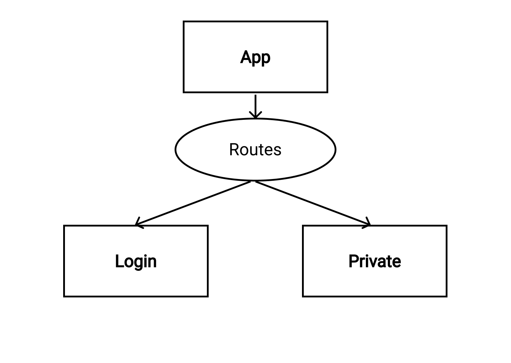

# Fullstack Review Prep

## Introduction
Instead of the standard toy problem/review, today a mentor will go over the planning process for a full-stack application, namely the application that will be built during the lectur later on in the day. This exercise is important because it is one of the few opportunities that we have to discuss the importance of solid planning when building a full-stack application, and it is also the last opportunity to go in depth on planning strategies before the cohort will start their personal projects.

The full-stack application that will be built later in the day is a  simple bank application that allows a user to log in and view their account information. There are only two views involved, but this example application will cover nearly every piece of technology that has been taught so far including: React, react-router, redux, express, massive, postgreSQL, and auth.

## 1. List Features
Make a list of desired features and color code by whether the feature is MVP or not. Its sometimes helpful to write user story by prefacing the feature with "as a user, I can..."
- As a user I can log in to the application
- As a user I can view my bank account information after successfully authenticating. A "please log in" message should be displayed if a user attempts to visit the private route without being successfully authenticated.

## 2. Sketch Component Tree
Draw out a basic layout of the component tree
<br />



## 3. Wireframe Views and Determine Routing
Draw a basic wireframe of each individual view and notate the route that will be used to access that view. Your wireframe does not need to be as detailed as the pictures below.

### Login View
#### Component: Login
#### Path: /
<br />


### Private View
#### Component: Private
#### Path: /private
<br />


## 4. Determine Redux Data
Explain that it is a good idea to plan ahead of time what data will be stored on redux to reduce the amount of time it would take to refactor code to incorporate redux later.
#### User data only
`user: { id, auth_id, user_name, user_pic }`

## 5. Plan Endpoints
Endpoints should be planned with the following information: 
- The verb: GET, POST, PUT, PATCH, DELETE, etc.
- The path: ie: /api/getstuff
- The items that the endpoint will receive and what object that data will be sent on. For example: 
  * __req.body:__ name, birthday, email. 
  * __req.params:__ productID. 
  * __req.query:__ min-price, max-price. 
  * __req.session.user:__ userID.
- What the endpoint will send back ie: 
  * Status(200)
  * Array of products
  
### Endpoints for the full-stack review
#### GET: /auth/callback
- Receive: Code from req.query, access token, user data
- Send: null, redirect to private view

#### GET: /api/user-data
- Receive: null
- Send: user data from req.session.user

#### GET: /api/logout
- Receive: null
- Send: status(200)

## 6. Plan Database Schema
Each table should be listed with the name of the column, the data type, and each table's primary and foreign keys. The full-stack review will only have one database table.
```
users (
    id SERIAL PRIMARY KEY,
    auth_id TEXT,
    user_name VARCHAR(180),
    user_pic TEXT
)
```


